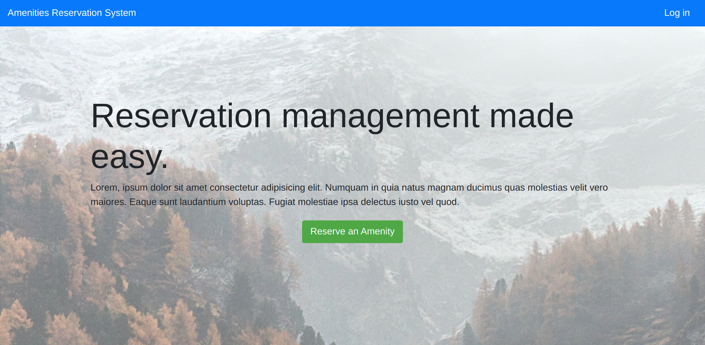

# amenity-reservation-system

A prototype for an amenity reservation system where users will log in and reserve a time to use a service such as fitness center, pool, or sauna. 

## Table of contents

- [Overview](#overview)
  - [Features](#features)
  - [Screenshot](#screenshot)
  - [Links](#links)
- [My process](#my-process)
  - [Built with](#built-with)
  - [Continued development](#continued-development)
  - [Useful resources](#useful-resources)
- [Author](#author)
- [Acknowledgments](#acknowledgments)

## Overview

### Features

Users are able to:

- log in(We will assume that the accounts of residents are pre-created and there will be no sign-up feature.)

- view their reservations.
- create new reservations by selecting the amenity type, date, and time (Only logged-in users should be able to see the reservations page and create reservations if the current number of reservations does not exceed the capacity).

### Screenshot

### Links

- Solution URL: [GitHub repo](https://github.com/Bluette1/amenity-reservation-system)

## My process

### Built with
- Bootify
- Hibernate
- Spring Boot
- Maven
- JPA
- Swagger
- H2 In-Memory Database
- Thymeleaf
- Bootstrap
- Spring Security

### Continued development

- Add a modal to display message to the user when the amenity type capacity has been reached.

### Useful resources

- [Spring Framework](https://spring.io/projects/spring-framework) - This is the documentation website for Spring.
- [Java Frameworks](https://data-flair.training/blogs/java-frameworks/) - Learn about Java frameworks.

## Author

- Website - [Marylene Sawyer](http://www.marylene.tech/)
- GitHub - [@Bluette1](https://github.com/Bluette1)
- Frontend Mentor - [@Bluette1](https://www.frontendmentor.io/profile/Bluette1)
- Twitter - [@MaryleneSawyer](https://twitter.com/MaryleneSawyer)

## Acknowledgments

- [Spring Boot Tutorial](https://www.freecodecamp.org/news/spring-boot-tutorial-build-fast-modern-java-app/)

